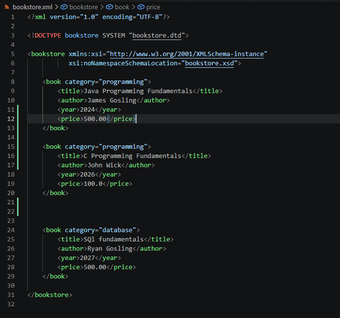
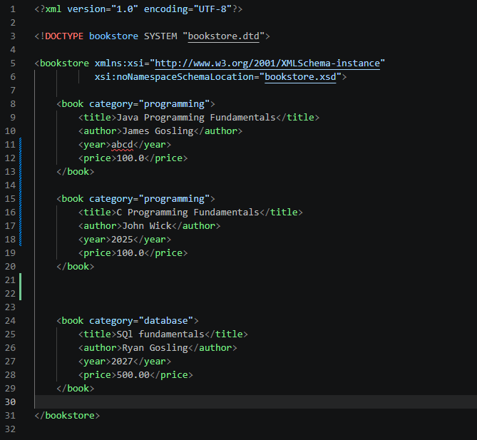
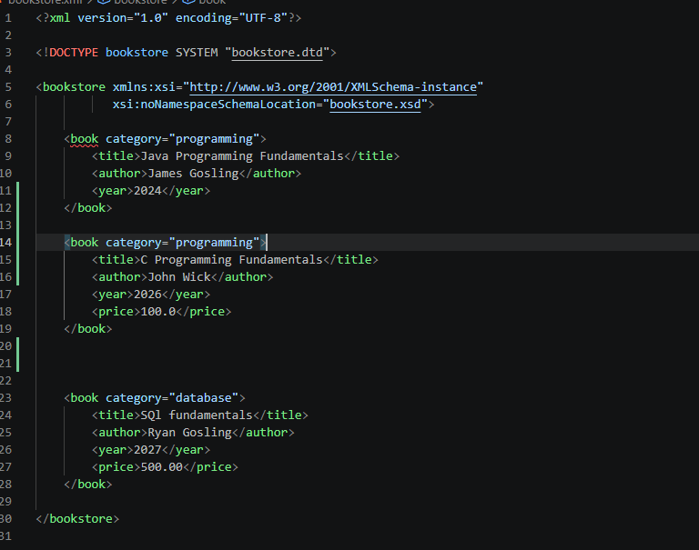
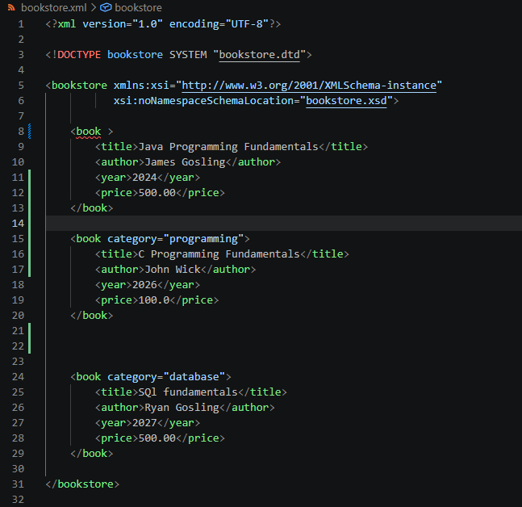

# 24071A05U7-wadext
Name : Theerdala Vignesh
Roll Number: 24071A05U7
Class : II B.TECH CSE-D
Examination: Web Application Development Laboratory External Examination

 SET-3: 
 Create and validate a bookstore XML using DTD and XSD . Publish the code on Github along with output screen shots.
 
 XML document following correct schema 

**YEAR**

XML documement with incorrect schema .

The book named Java Programming Fundamentals has year in wrong format .

So an error is shown in the xml document at element year in the corresponding book element

**PRICE**

XML documement with incorrect schema .

The book named Java Programming Fundamentals has element price missing .

So an error is shown in the xml document

**CATEGORY**

XML documement with incorrect schema .

The book named Java Programming Fundamentals has attribute category missing .

So an error is shown in the xml document

